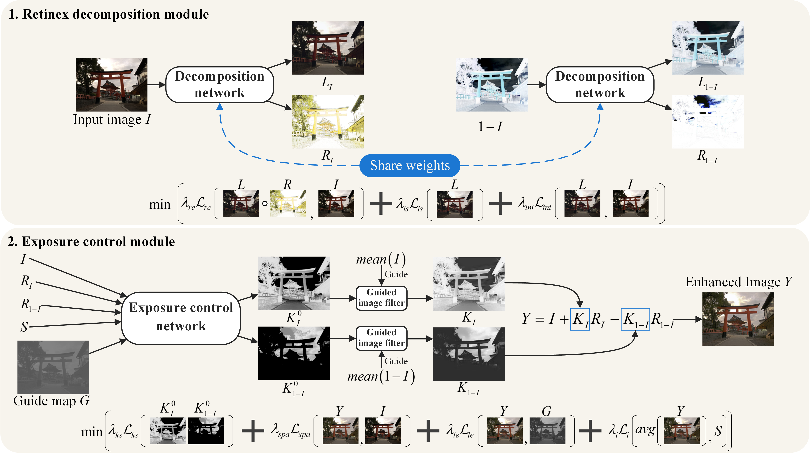
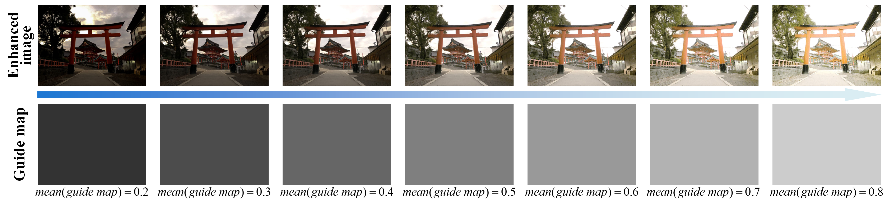

# Retinex-based Exposure Control Using Unsupervised Learning

ECCV 2024 paper#9482

## Introduction

This repository is the code of the paper, "Retinex-based Exposure Control Using Unsupervised Learning".

## Requirements

The enviroment we use in UREC is listed below: 

    Python 3.11.0
    torch 2.1.0
    torchvision 0.16.0
    cuda 12.1
    numpy 1.23.5
    matplotlib 3.4.3
    opencv-python 4.7.0.72
    scikit-image 0.20.0
    scipy 1.10.1
    tqdm 4.65.0
    lpips 0.1.4

## Test:

The weight files are put in dir ./weights

You can reproduce the experimental results in our paper by execute the following command (come path may need be changed in codes):

    cd UREC_code

    python test_EED.py ### To get visual results on EED (need change path)

    python test_sice.py ### To get visual results on SICE (need change path)

    python test_EED.py ### To get quantative results on EED (calculate psnr, ssim and lpips, need change path)

    python test_sice.py ### To get quantative results on SICE (calculate psnr, ssim and lpips, need change path)

    #### eval_EED.m and eval_sice.m are used to calculate niqe, which need to be processed in matlab (need change path)

## Dataset

MSEC dataset: please refer to https://github.com/mahmoudnafifi/Exposure_Correction

SICE dataset: In our paper, we divide SICE dataset into overexposed, underexposed and standard images, here we dot not put link of it due to anonymity.

## Ours Results

We dot not put link of our results due to anonymity.

## Contact

## Cite